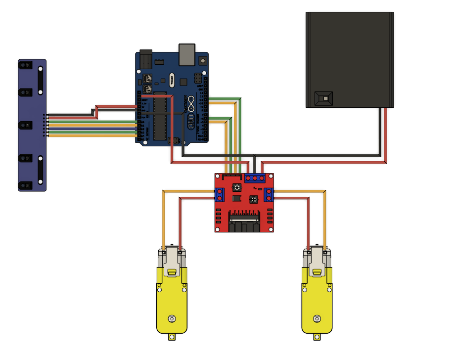
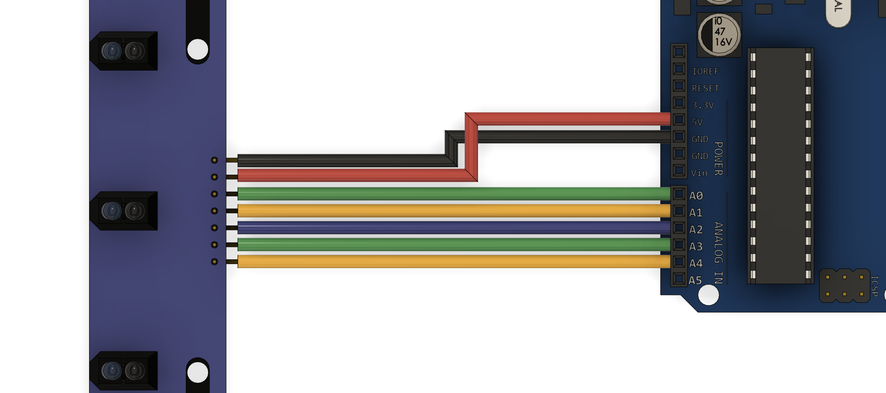
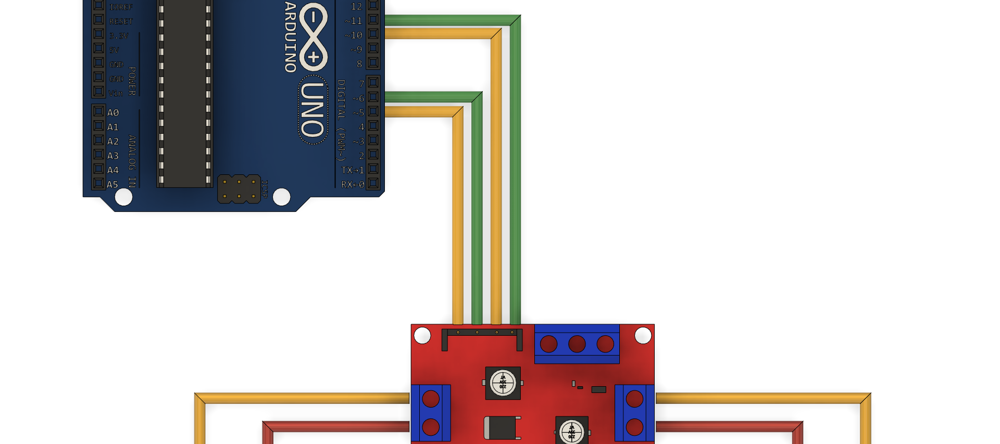
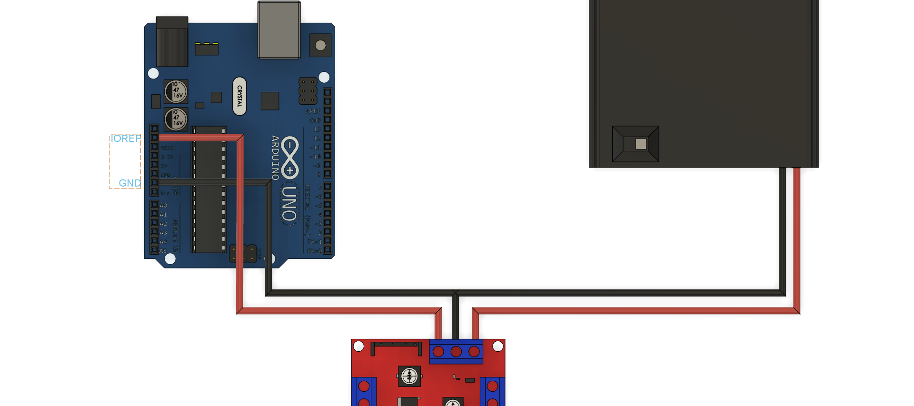

Electrical
==========

Overview
--------

Below the overall wiring schematic is shown. Scroll further down for a step by step breakdown. 

Infrared Sensor
---------------

In the previous :ref:`hardware assembly section <Assembly>`, the infrared sensor was attached with the header pins facing towards the front of the robot. Confirm this is correct before proceeding. Using seven male-female header pins connect the infrared sensor to the arduino anaolg pins and power pins as shown below, note that there is a slot in the robots frame to pass the wires through. Ensure the power cables (GND and 5V) are crossed over as shown in the picture below.

Motors 
------

Connect the motors the the L298N motor driver screw terminals using the wires that were soldered to the TT motor gearbox in the :ref:`hardware assembly section <Assembly>`. Use 4 male-female jumper cables to conenct the L298N motor driver to Arduino digital pins 5, 6, 10, and 11. Finally, confirm the three `header pin jumpers <https://www.sparkfun.com/products/9044>`__ are installed on the ENA, ENB, and 5V EN pins (as comes stock). More information on the L298N motor driver and header pins available `here <https://lastminuteengineers.com/l298n-dc-stepper-driver-arduino-tutorial/>`__.

Power
-----

To power the robot we will use 4 AA batteries in series giving a voltage of 6V. Make the connections below, note that the black ground wire from the battery is spliced (and ideally soldered) to a second black wire that connects to the GND pin of the Arduino. The red wire coming out of the L298N 5V terminal will power the Arduino. However we already occupied the 5V pin in the :ref:`infrared sensor electrical connection <Infrared Sensor>`. Thus instead we will connect this red 5V wire to the IOREF pin, which it the input/output reference voltage pin that connects to the Arduino logic voltage which just so happens to be 5V. 

.. note::
   The L298N motor driver is incredibly inefficient (hence the large metal hink sink) and drops about 2V, meaning the motors are only getting around 4V. This is okay since the TT motors are rated for 3V - 6V, but if you want more power you could use a battery with a higher voltage such as a 7.4V lipo. While the L298N motor driver is inefficient it was chosen for this project as it is cheap, widely available, and there are plently of great online tutorials for beginners. I would recommend using this motor driver for most beginner projects and then switching to something like the slighty more expensive Cytron MDD10A motor driver down the line. 