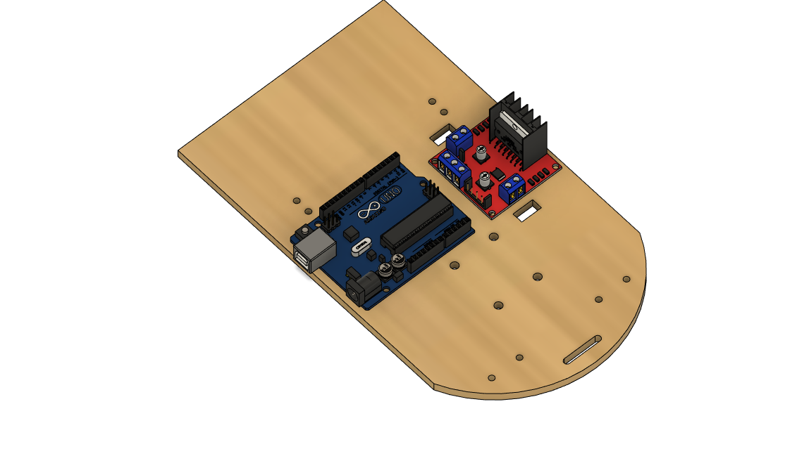
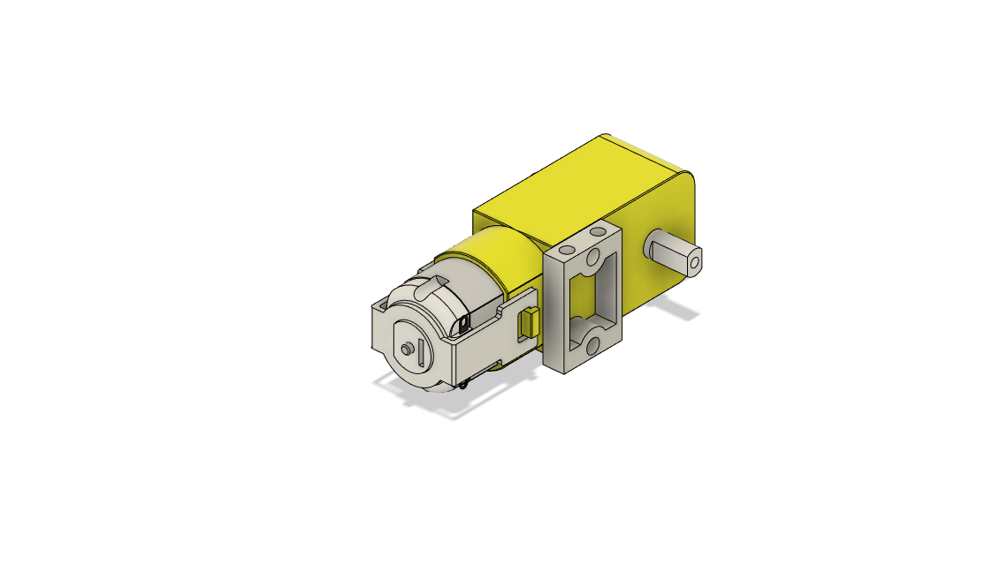
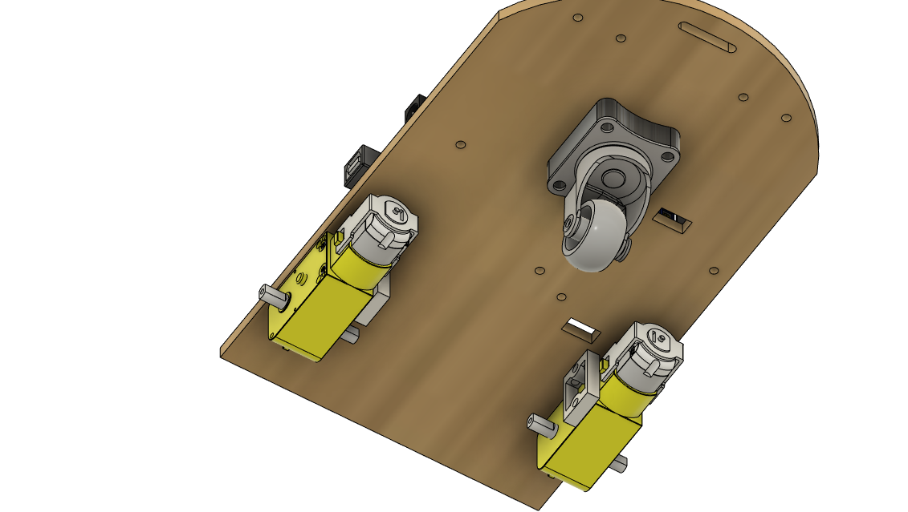
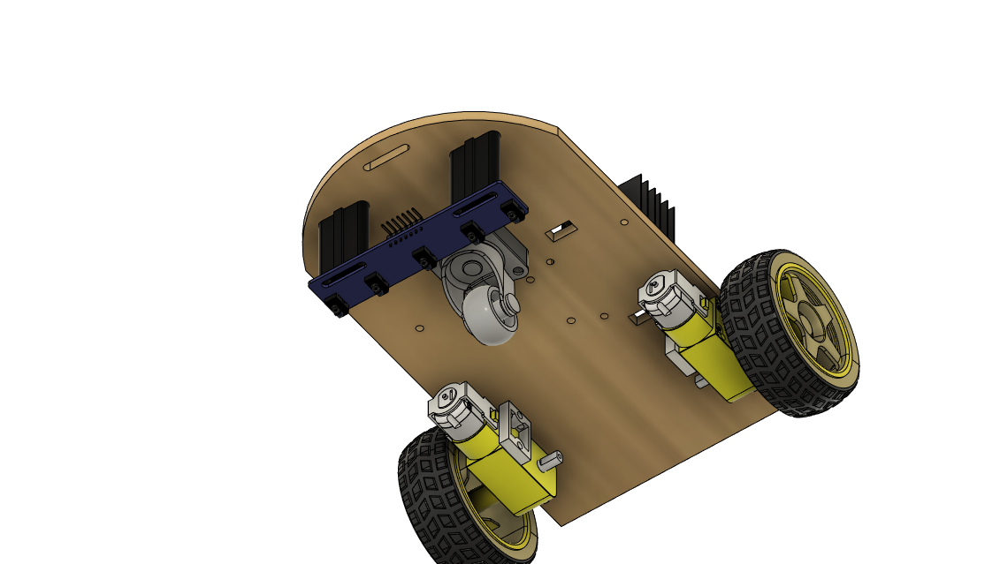
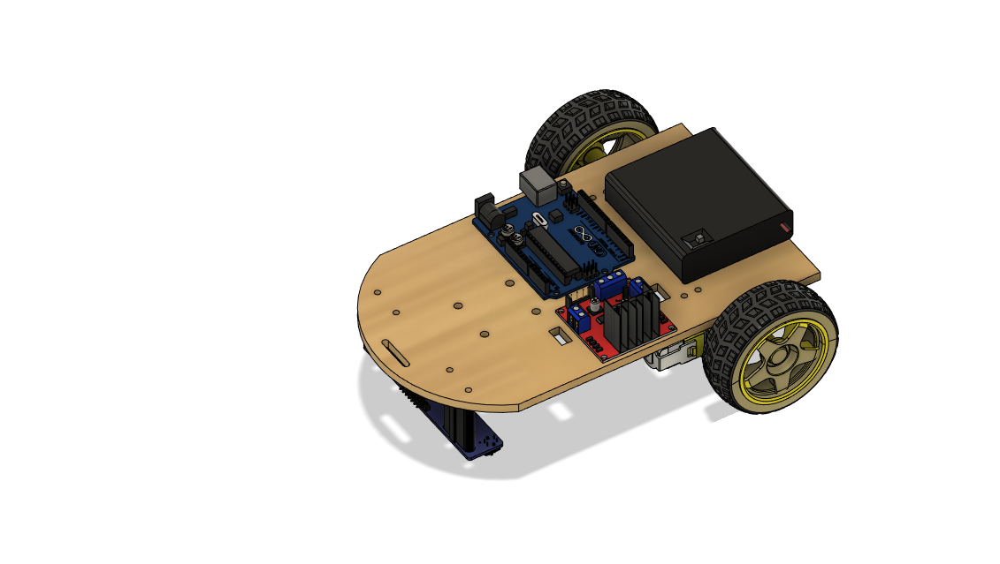

Hardware
========

This project is open source and a bill of materials is freely provided (below). However, if you prefer to purchase a prepared robot kit that will also financially support the development of more open source projects then you can purchase the robot here: <coming soon - insert link>

Bill of Materials
-----------------

**Off the shelf components**

* 1x Arduino Uno (with cable)
* 1x L298N Motor Driver
* 1x AA battery holder with ON/OFF switch (4 slots) 
* 4x AA batteries
* 2x Set of TT DC motor gearbox, wheel, mounting bracket, two M3 10mm bolts, two M3 30mm bolts, and two M3 nuts (usually sold all together)
* 1x One inch caster wheel
* 1x Five channel TCRT5000L array 
* 13x Male-Female jumper cables
* 2x Male-Male jumper cables
* 15x M3 12mm bolts
* 4x M4 20mm bolts
* 7x M3 nuts (optional use lock-nuts or loctite)
* 4x M4 nutes (optional use lock-nuts or loctite))
* Extra wire for motor leads (18 AWG - 22AWG)
* Zipties (optional for cable management)
* Double sided tape or hot glue for securing the battery pack

**Components to be fabricated**
See the next section for more details

* 1x Robot body (laser cut from 3mm to 5mm wood or acrylic)
* 1x Caster wheel spacer (3D printed)
* 2x Infrared sensor standoffs (3D printed)

**Tools**

* Soldering iron and solder
* Computer and approatiate dongle/cable for connecting to Arduino Uno
* Wire strippers (optional)
* Multimeter (optional - for diagnostics)

Manufacturing
-------------

When it comes to robotics, being able to fabricate custom components is extremely valuable, however buying your own 3D printer, laser cutter, and/or CNC machine is cost probihitive to starting a journey into robotics. Fortunately these custom pieces are available for purchase from my website <insert link - coming soon>. Alternatively online 3D printing services are available, and for some, these tools may be available locally at makerspaces, public libraries, or universities at little or no cost. These components are not dimension critical so they can also be fabricated by hand out of scrap wood and a hand drill or even out of sheets of cardboard.

**Robot body**

The SVG file for laser cutting the body can be downloaded `here <https://github.com/WillDonaldson/Line_Following_Robot/blob/main/Fabrication_Files/line-following-robot-frame.svg>`__. Birch wood is a great option as it is cheap and also compresses a little bit when the bolts are tightened, tereby preventing the bolts from vibrating loose. If using acrylic, it is recommended that you use lock-nuts or apply loctite to the bolts. If you do not have access to a laser cutter, you can print out the SVG file and use it as reference to cut your own robot frame out of cardboard or wood. 

**Caster wheel spacer**

File for 3D printing available `here <https://github.com/WillDonaldson/Line_Following_Robot/blob/main/Fabrication_Files/Wheel%20Spacer.3mf>`__.

**Infrared sensor standoffs**

File for 3D printing available `here <https://github.com/WillDonaldson/Line_Following_Robot/blob/main/Fabrication_Files/Infrared%20Sensor%20Standoff%20Bracket.3mf>`__.

Assembly
--------

**Step 1**
Mount the Arduino and motor driver in the orienation shown below using seven of the M3 12mm bolts and nuts

**Step 2**
Mount the motors to their brackets. Note the orienation of the motor pin orientation relative to the bracket. The image below shows the assembly for the right motor (left motor is the mirror image). Before mounting to the robot frame, solder wires to the motors to conect to the motor driver (length ~14cm).

**Step 3**
Attach the motors using M3 bolts and the caster wheel using M4 bolts. Note the 3D printed caster wheel spacer.

**Step 4**
Install the infrared sensor array using the 3D printed standoffs. Note the orientation of the header pins, they should face towards the front of the robot, if not they will collide with the caster wheel and make wiring more difficult.

**Step 5**
Attach the battery pack using double sided tap or hot glue to secure in place.

