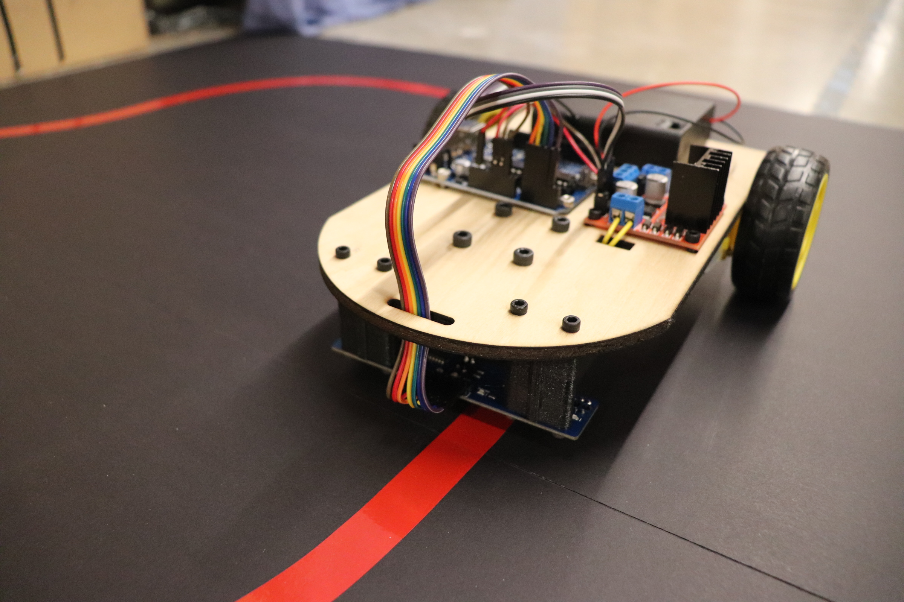

Documentation for building a line following robot!
=================================================================

This project aims to provide step by step instruction to building your first robot from scratch. This beginner friendly project has no prerequistes but will link to additional external resources for gaining a deeper understanding and taking your new skills to the next level.

The robot uses a two motor differential drive with a freely spinning caster wheel at the front of the robot. The array of infrared sensors detect reflected light to deterimine if the sensor is over a dark material (no reflection) or light material (reflection). 

.. note::

   This project is under active development. More updates coming soon.

Contents
--------

.. toctree::

   Hardware
   Electrical
   Arduino Overview
   Sensors and Actuators
   Bang-Bang Algorithm
   Advanced (PID) Algorithm
   Debugging, Troubleshooting, and Resources
   Related Projects